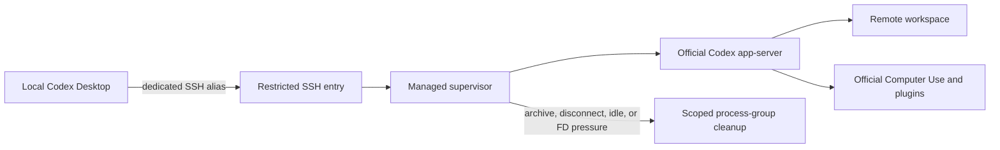

# Codex Managed Channel

[](https://github.com/fantasyce/codex-managed-channel/actions/workflows/ci.yml)
[](https://github.com/fantasyce/codex-managed-channel/releases/latest)
[](LICENSE)

[简体中文](README.zh-CN.md)

Codex Managed Channel adds a lifecycle-controlled SSH route from Codex Desktop
to an existing remote Mac. It launches the official Codex app-server and the
official Computer Use plugin on that remote Mac, while reclaiming abandoned
process groups and file descriptors after archive, disconnect, or bounded idle.

This is an unofficial community project. It is not an OpenAI product and does
not modify or redistribute ChatGPT Desktop, Codex, or Computer Use components.

## Is this for me?

Use this project when Codex Desktop already reaches a remote Mac over SSH, you
want the remote Mac's official Computer Use and plugin environment, and
abandoned app-server/MCP children need a bounded cleanup policy. It is not a
general-purpose SSH client, a replacement agent harness, or a Linux/Windows
remote-workspace solution.



## Why

An ordinary long-lived remote channel can leave app-server, MCP, Node REPL, and
pipe resources behind when clients disappear unexpectedly. This project puts a
small supervisor at the SSH boundary, gives each connection an isolated
app-server socket, observes only lifecycle metadata, and reaps only the process
group it created.

## Quick start

Prerequisites: macOS on both sides, ChatGPT Desktop and Codex already installed
and authenticated on the remote Mac, and a working administrative SSH alias.

```sh
curl -fsSL https://raw.githubusercontent.com/fantasyce/codex-managed-channel/v0.1.0/install.sh | \
  sh -s -- --remote example-host --alias example-managed \
  --repository fantasyce/codex-managed-channel --version v0.1.0
```

The installer verifies the release checksum before generating a dedicated
Ed25519 key or changing either SSH configuration. For a review-first procedure,
see [Installation](docs/installation.md).

After installation, restart Codex Desktop if the new SSH alias is not listed,
then open `example-managed` like any other remote connection.

For a fully synthetic, machine-neutral demonstration of install, use, reclaim,
and uninstall, see the [90-second walkthrough](docs/90-second-walkthrough.md).

## What has been verified

Version 0.1.0 passed the Rust and installer suites, strict linting, source and
Git-history privacy scans, checksum-verified installation, idempotent reinstall,
official app-server initialization, a read-only official Computer Use call,
zero managed processes/sockets after exit, and exact uninstall. The acceptance
used disposable identifiers and retained no machine or account data. See the
[redacted acceptance record](docs/acceptance-0.1.0.md).

## Safety properties

- no telemetry and no analytics;
- no private key leaves the client Mac;
- no public network listener is created;
- existing SSH configuration and authorization lines are preserved;
- archive and idle cleanup use a cancelable drain window;
- active turns are not reclaimed by the idle policy;
- unsupported SSH or Desktop layouts fail closed.

See [Architecture](docs/architecture.md), [Security model](docs/security-model.md),
[Compatibility](docs/compatibility.md), and [Troubleshooting](docs/troubleshooting.md).

## Uninstall

```sh
./uninstall.sh --remote example-host --alias example-managed
```

Logs and managed state are retained by default. Explicit permanent state removal
requires `--purge purge`.

## License

MIT. Third-party products and trademarks remain the property of their owners.
