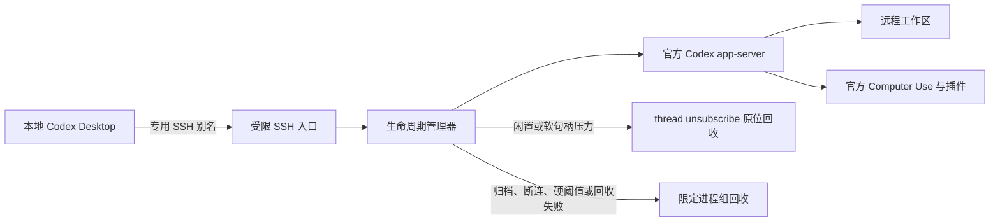

# Codex Managed Channel

[](https://github.com/fantasyce/codex-managed-channel/actions/workflows/ci.yml)
[](https://github.com/fantasyce/codex-managed-channel/releases/latest)
[](LICENSE)

[English](README.md)

Codex Managed Channel 为 Codex Desktop 增加一条具有生命周期管理能力的
远程 macOS SSH 通道。远端仍运行官方 Codex app-server、官方 Computer Use
插件和用户现有的 ChatGPT 登录状态；本项目只负责隔离连接、限制入口并回收
归档、断连或超时闲置后遗留的进程与文件句柄。

这是 unofficial 社区项目，并非 OpenAI 官方产品，也不修改或分发 ChatGPT
Desktop、Codex 或 Computer Use 的专有组件。

## 适用场景

当 Codex Desktop 已通过 SSH 连接远端 Mac，希望继续使用远端官方 Computer
Use 和插件环境，同时需要对遗留 app-server/MCP 子进程进行边界明确的回收时，
可以使用本项目。它不是通用 SSH 客户端、替代 Agent Harness，也不解决 Linux
或 Windows 远程工作区问题。



## 快速安装

前提：本地和远端均为 macOS；远端已安装并登录 ChatGPT Desktop/Codex；
本地已有可用的管理 SSH 别名。

```sh
curl -fsSL https://raw.githubusercontent.com/fantasyce/codex-managed-channel/v0.1.0/install.sh | \
  sh -s -- --remote example-host --alias example-managed \
  --repository fantasyce/codex-managed-channel --version v0.1.0
```

安装器会先校验发布包 SHA-256，再生成专用 Ed25519 密钥并写入配置。私钥只
保留在本地。需要先下载审阅再执行时，请参考
[安装说明](docs/installation.md)。安装后若 Codex Desktop 没立即显示新别名，
重启一次 Desktop，然后像普通远程连接一样选择 `example-managed`。

完整的安装、使用、回收和卸载过程见[90 秒匿名演示](docs/90-second-walkthrough.md)。
其中只使用合成别名和通用路径，不包含任何真实机器信息。

## 已验证内容

开发中的有界重连机制及独立验收边界见[有界恢复说明](docs/bounded-recovery.md)。
它要求每个客户端独立 alias/key；现有 v0.1.0 安装不会自动获得此功能。

0.1.0 已通过 Rust 与安装器测试、严格 lint、源码与 Git 历史隐私扫描、校验和
安装、重复安装、官方 app-server 初始化、官方 Computer Use 只读调用、退出后
进程与 socket 清零以及精确卸载。验收只使用一次性标识符，不保留机器或账号
信息，详情见[脱敏验收记录](docs/acceptance-0.1.0.md)。

## 安全边界

- no telemetry（无遥测、无分析上报）；
- 不新增公网监听端口；
- 不覆盖其他 SSH Host 或授权行；
- 只回收本通道创建并验证过的进程组；
- 活跃对话不会被闲置策略回收；
- 空闲线程优先通过 `thread/unsubscribe` 回收 MCP、PIPE 和 FD，不主动断开 SSH；
- 不支持的 SSH 或 Desktop 布局会停止安装。

详细内容见[架构](docs/architecture.md)、[安全模型](docs/security-model.md)、
[兼容性](docs/compatibility.md)和[排障](docs/troubleshooting.md)。

卸载：

```sh
./uninstall.sh --remote example-host --alias example-managed
```

默认保留日志和状态；永久清理必须明确传入 `--purge purge`。
