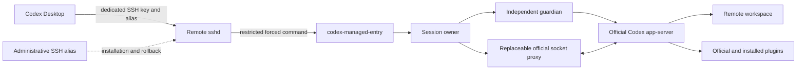
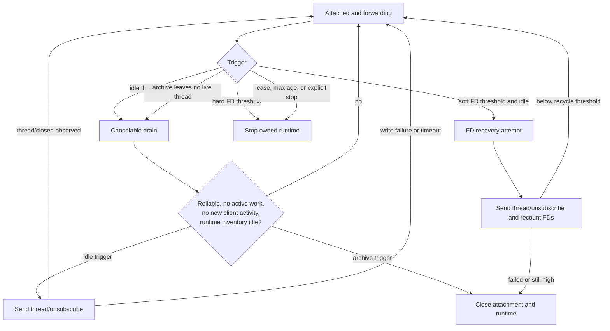
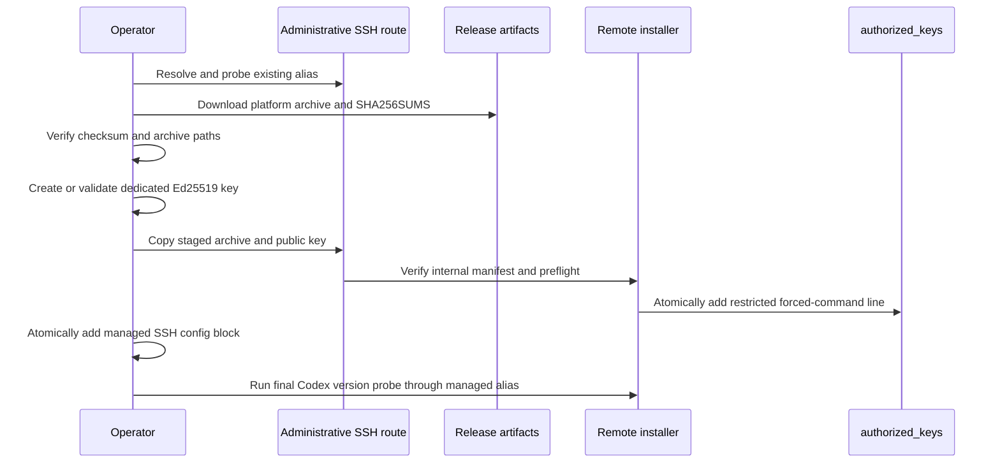

# Architecture

This document describes the v0.2.0 source tree. The `v0.1.0` tag contains only
legacy per-connection supervision; v0.2.0 adds the fixed-identity bounded
session described below.

## 1. Purpose and boundaries

Codex Managed Channel is a small control layer at an SSH boundary. It lets Codex
Desktop use the official Codex app-server and official plugins on a remote Mac
while bounding the lifetime of the process tree and its file descriptors.

The project does:

- validate the limited bootstrap commands emitted by Codex Desktop;
- start an isolated official app-server and an official socket proxy;
- forward protocol bytes without changing user requests or server responses;
- observe lifecycle metadata needed to decide whether cleanup is safe;
- try `thread/unsubscribe` before a soft resource-pressure disconnect;
- terminate only the process tree created for the managed identity; and
- install a restricted, dedicated-key SSH entry without replacing the
  administrative SSH route.

The project does not:

- implement an agent, model gateway, SSH daemon, or alternative app-server;
- inspect prompt text, tool arguments, tool results, or credentials for policy;
- replay a turn, approve a request, or retry an uncertain external action;
- provide a security boundary between clients that share the same remote OS
  account; or
- guarantee containment of a deliberately escaping process or survival across
  a machine crash.

## 2. System context



The administrative route and managed route have different jobs. The installer
uses an already working administrative alias to place a verified release. It
then creates a new local alias backed by a dedicated key. That key is authorized
only for the forced managed entry and cannot request a shell, PTY, forwarding,
or agent forwarding.

## 3. Runtime modes

The entry binary supports two externally reachable modes.

| Mode | Forced-command arguments | Ownership | Reconnect behavior |
|---|---|---|---|
| Legacy | no arguments | one worker per SSH connection | a new connection creates a new worker |
| Bounded session | `--client-id ID` | one owner and worker per fixed server-side ID | a new proxy may attach to the surviving worker |

The bounded mode is the normal mode written by the current installer. Legacy
mode remains for compatibility and is not silently converted.

Three internal commands support bounded mode: `--session-owner`,
`--session-worker`, and `--stop-client`. They are rejected whenever
`SSH_ORIGINAL_COMMAND` exists, so a remote client cannot select an internal
maintenance path. The client ID accepts only 1-32 ASCII letters, digits, dashes,
or underscores. It is fixed in `authorized_keys`; it is never accepted from the
Desktop command or an SSH environment variable.

## 4. Bootstrap validation

The restricted entry receives the original command from sshd and parses it as
data. It does not pass the string to a shell.

Validation is fail closed:

1. the command must be non-empty and no larger than 64 KiB;
2. NUL, CR, and LF are forbidden;
3. exactly one supported action must be present;
4. probes and proxy markers must occur in their expected terminal position; and
5. exactly one eight-byte octal nonce must be present.

Supported actions are the Codex path probe, version probe, app-server bootstrap,
and app-server proxy. The entry writes the validated nonce back before handling
the action. Unknown arguments, mixed actions, malformed nonces, and attempted
command suffixes are rejected.

## 5. Bounded-session process model

```text
sshd forced command
└── short-lived attach process
    └── Unix control connection to one fixed identity

detached session
└── owner (setsid; owner.lock)
    ├── control.sock       accepts at most one attached proxy
    ├── stop.sock          local maintenance request
    └── guardian/reaper    holds a duplicate ownership lock
        └── official app-server process group
            ├── official socket proxy for the current attachment
            └── MCP/plugin descendants
```

### 5.1 Startup fencing

`startup.lock` serializes attachment and owner startup. `owner.lock` prevents a
second owner while the first owner, its guardian, or cleanup is still active.
Lock files and session directories must be owned by the effective user, private,
regular files/directories, and not symlinks.

If no control socket is available, the attach process starts a detached owner.
The owner starts the guardian with a duplicate of `owner.lock`. The guardian
starts the app-server before reporting readiness. This ordering prevents a
replacement owner from starting while an earlier worker is still being reaped,
including when the owner dies during startup.

### 5.2 Single writer

Only one attachment is accepted for a client identity. A second attachment
receives a negative acknowledgement. The current attachment must finish closing
before another proxy can attach. Reconnect replaces the proxy, not the
app-server, and therefore does not create a second writer for the same runtime.

Different IDs get different state directories, locks, control sockets, owners,
and app-servers. They still use the same remote OS account and may reference the
same authenticated Codex data; this is operational separation, not hostile
multi-tenant isolation.

### 5.3 Owner/guardian failure handling

The guardian watches an owner pipe. Owner exit closes the pipe and causes the
guardian to terminate and reap the worker group. While the worker is alive, a
process registry records descendant PID, process-group, and start-time tuples.
Cleanup revalidates these tuples before signaling, which avoids acting on a
reused numeric PID and can find a previously observed descendant after it has
been reparented.

The registry is polling, not a kernel process container. A child that forks,
escapes, and becomes orphaned entirely between samples may not be observed.
Simultaneous forced death of both owner and guardian and a machine crash are
also outside the guarantee.

## 6. Protocol transport and observation

The owner starts the official app-server with a private Unix socket and starts
an official `app-server proxy --sock ...` for each attachment. Two copier
threads move client-to-server and server-to-client bytes. The observer receives
the same byte slices that are written onward; ordinary protocol traffic is not
rewritten.

The observer accepts JSON lines and WebSocket text frames. WebSocket buffers and
control messages are bounded at 64 MiB. It tracks only state needed for safe
reclamation:

- pending request IDs and request methods;
- loaded/live thread IDs and explicit `thread/closed` events;
- active `(thread ID, turn ID)` pairs;
- resumed or server-started work;
- pending commands that represent work even without a thread;
- client activity generation and idle duration;
- empty-after-archive epochs;
- managed unsubscribe accept/reject counts; and
- resume attempts used by the takeover coordinator.

Ambiguous identity, malformed protocol, an impossible transition, or an
unbounded/unsupported message makes the observation unreliable. An unreliable
observer never authorizes idle or soft-FD reclamation. This is deliberately
fail closed.

## 7. Reclamation state machine

There are four independent cleanup families. They must not be treated as one
600-second disconnect timer.



### 7.1 Ordinary idle: unsubscribe, not disconnect

The default idle threshold is 600 seconds. After a cancelable drain, the owner
gates client forwarding and verifies all of the following:

- the protocol observer is reliable;
- no active turn or protected command exists;
- no new client activity occurred during the decision;
- the official loaded-thread inventory completed within its deadline; and
- every loaded thread has explicit `idle` status.

The owner then injects a standards-compliant masked WebSocket
`thread/unsubscribe` request for each known idle thread. These internal requests
do not count as Desktop activity. The owner waits for the corresponding
`thread/closed` observations. With the app-server configured for a short official
thread-unload delay, this releases thread-scoped MCP processes, pipes, and file
descriptors while keeping the app-server, proxy, and SSH connection alive.

An empty idle connection is a no-op. A rejected request, write error, or unload
timeout is logged and the idle timer is restarted; ordinary idle cleanup does
not disconnect merely because unsubscribe failed.

### 7.2 Archive reclamation

When protocol state proves that archive has left no live thread, a drain begins.
Any activity, active work, or unreliable protocol cancels it. After the drain,
the attachment and owned runtime are closed. Archive is a terminal ownership
signal rather than the periodic thread-unload operation used for ordinary idle.

### 7.3 File-descriptor pressure

The app-server process is sampled periodically with `lsof`. Thresholds must
satisfy `0 < warn < recycle < hard`.

| Default | Action |
|---:|---|
| 160 | log a warning |
| 192 | when idle long enough, try unsubscribe and recount |
| 240 | stop the owned runtime regardless of activity |

At the recycle threshold, the same reliable-idle and official-inventory checks
apply. If unsubscribe closes threads and the post-operation FD count returns
below the recycle threshold, the connection continues. If unsubscribe fails,
times out, closes nothing, or leaves the count too high, bounded disconnect and
process-tree cleanup remain the fallback. The hard threshold is an independent
safety fence and always stops the owned runtime.

The FD sampler currently observes the app-server process, not an independently
budgeted process group for each tool call. Descendant FD exhaustion can therefore
fail or stall one task without immediately crossing the app-server thresholds.
Task failure alone is not a cleanup guarantee. Version 0.2.0 has no reliable
task-to-process-group mapping, so it cannot terminate only that task and prove
that all child and parent-side descriptors were reclaimed. If pressure reaches
the app-server hard threshold, the whole owned runtime is stopped and active
turns are interrupted.

### 7.4 Connection lease, absolute lifetime, and explicit stop

These mechanisms are independent of the 600-second ordinary-idle policy:

| Setting | Default | Meaning |
|---|---:|---|
| `CODEX_MANAGED_EOF_GRACE_SECS` | 45 s | maximum one continuous detached interval |
| `CODEX_MANAGED_DETACH_BUDGET_SECS` | 300 s | cumulative detached time for this worker |
| `CODEX_MANAGED_SESSION_MAX_SECS` | 86400 s | absolute worker lifetime |
| `CODEX_MANAGED_TERM_GRACE_SECS` | 5 s | TERM grace before forced cleanup |
| `CODEX_MANAGED_IDLE_SECS` | 600 s | ordinary idle threshold before a drain |
| `CODEX_MANAGED_DRAIN_SECS` | 3 s | cancelable drain duration |
| `CODEX_MANAGED_THREAD_UNLOAD_SECS` | 2 s | official unload delay after last subscriber |
| `CODEX_MANAGED_THREAD_RECLAIM_WAIT_SECS` | 10 s | maximum wait for thread closure |
| `CODEX_MANAGED_SAMPLE_SECS` | 15 s | FD sample interval |
| `CODEX_MANAGED_IDLE_RECYCLE_SECS` | 300 s | idle required for soft FD recovery |

Closing Desktop starts the detached lease. Reconnect does not reset the worker's
birth time or cumulative detached budget. Reaching either limit stops the
runtime even if work is active; bounded resource ownership takes precedence
over unlimited execution.

`--stop-client ID` is a local maintenance command. It connects to `stop.sock`,
waits for the ownership fence to clear, and affects only that ID. The remote
uninstaller calls this before removing an installation. It is not reachable via
the forced SSH command.

## 8. Reconnect semantics

Reconnect creates a new official proxy to the surviving app-server. It does not
send another `turn/start`, synthesize a continuation message, automatically
approve anything, or replay tool side effects. Desktop uses its normal
`thread/resume`, read, and subscription flow to recover current state.

A turn that completed while Desktop was offline remains completed. A worker
that has already been reclaimed cannot be resumed in memory; a later attachment
starts a fresh isolated runtime and can still use persisted history. Pending
approvals remain user decisions.

The generated SSH alias uses a 15-second server-alive interval, three missed
responses, and no connection multiplexing. These settings detect a dead path and
preserve single-writer ownership, but cannot prevent sleep, Wi-Fi loss, network
blackholes, server failure, or provider-stream failure. A half-open old
connection may temporarily cause a safe rejection of the new attachment.

## 9. Cross-runtime thread takeover

A thread can already be loaded by the ordinary shared Desktop app-server when
the managed isolated app-server receives a resume attempt. The takeover manager
uses only official app-server RPCs:

1. read the thread from the isolated runtime;
2. if already loaded there, do nothing;
3. read it from the shared runtime;
4. refuse takeover unless its status is explicitly `idle`;
5. archive it in the shared runtime;
6. unarchive it in the isolated runtime; and
7. if that fails, attempt to unarchive it back in the shared runtime.

An active thread, unknown status, partial inventory, transport failure, or
timeout is not treated as idle. The code never edits database or lock files.

## 10. Managed Codex home and plugins

Each managed state root contains a private `codex-home`. Shared, durable entries
from the real Codex home are symlinked, while runtime-sensitive entries remain
private. Private entries include configuration, control/daemon directories,
IPC, logs, process-manager state, session indexes, temporary state, global state
files, and SQLite/WAL/SHM files.

The managed configuration is regenerated atomically with mode `0600`. It:

- removes the current OS-home project entry;
- removes obsolete `node_repl` and `computer-use` MCP definitions that would
  mask the current unified plugin;
- injects the installed `unified-computer-use` MCP definition;
- resolves relative plugin paths and official Desktop runtime resources;
- points SQLite persistence to the real Codex home; and
- points personal and bundled marketplaces to generated managed catalogs.

Marketplace catalogs are built from installed plugin manifests on the machine;
the repository contains no user plugin inventory. Links select the newest
installed manifest-bearing version and are replaced atomically. A non-symlink
at a managed link location causes a fail-closed error rather than deletion.

## 11. Installation and trust chain



The installer supports macOS clients and remote macOS targets for the packaged
architectures. It validates aliases, release versions, repository names, the
resolved administrative SSH configuration, platform, checksums, archive paths,
the release manifest, and the public-key shape. It rejects an unsupported
`ProxyCommand`, reusing one key for another managed authorization, or replacing
an unmanaged local alias block.

The remote preflight verifies the bootstrap parser, installed Codex binary,
isolated `app-server --listen`, socket `app-server proxy --sock`, marketplaces,
managed home, and required Desktop resources before modifying authorization.
Existing SSH configuration and `authorized_keys` are backed up and rewritten
atomically. Uninstall removes only marked entries; state is retained unless the
operator supplies the explicit purge confirmation.

## 12. Security and privacy properties

- The private SSH key stays on the client machine.
- The managed public key cannot open a shell or forwarding channel.
- No public network listener is created; app-server control uses Unix sockets.
- Session directories, locks, config, and logs use private permissions and
  reject unsafe symlink/type/ownership cases.
- Process cleanup is scoped to observed groups created for the managed runtime.
- Log writes use `O_NOFOLLOW`, a file lock, private permissions, and bounded
  rotation.
- Logs contain timestamps, event names, process IDs, counters, and OS error
  numbers; raw protocol, task text, tool content, and credentials are not logged.
- The repository privacy scanner checks the working tree, Git history, commit
  and tag metadata/messages, release archives, common credential shapes,
  machine paths, network addresses, and optional operator-provided literals.

The public repository cannot prove that a local deployment, shell history,
Git-host cache, or third-party mirror is clean. Operators must use a machine-
specific external literal list during release review and separately verify host
configuration and hosting-platform metadata.

## 13. Failure behavior and observability

Operational events are appended to `log/supervisor.jsonl`. The active log and
one rotated predecessor are bounded to approximately 1 MiB each. Important
event families include:

- worker and runtime start/exit;
- client attach, detach, and active-attach refusal;
- lease expiry, absolute lifetime, and explicit stop;
- protocol unreliability and forwarding termination;
- archive drain/reclaim;
- unsubscribe accepted, rejected, completed, remaining, timeout, and failure;
- FD warning, recovered unsubscribe, recycle fallback, and hard stop; and
- takeover outcome, including rollback failure.

Logging failure does not change transport bytes. Protocol uncertainty prevents
soft cleanup, while hard lifecycle/resource fences remain enforceable.

## 14. Source map

| Path | Responsibility |
|---|---|
| `src/bin/codex-managed-entry.rs` | external and internal entry-mode dispatch |
| `src/bin/codex-managed-preflight.rs` | installation compatibility preflight |
| `src/bootstrap.rs` | strict original-command and nonce parser |
| `src/session.rs` | bounded owner, guardian, attachment, unsubscribe, and deadlines |
| `src/supervisor.rs` | worker creation, byte copying, process cleanup, FD sampling, logs |
| `src/protocol.rs` | fail-closed JSON/WebSocket lifecycle observer |
| `src/reclaim.rs` | cancelable archive/idle drain state machine |
| `src/fd_guard.rs` | warning, soft-recycle, and hard-stop policy |
| `src/takeover.rs` | official-RPC idle check and cross-runtime takeover |
| `src/managed_home.rs` | isolated runtime home and sanitized configuration |
| `src/marketplace.rs` | local installed-plugin catalog and safe links |
| `install.sh` | client-side release, key, SSH config, and remote orchestration |
| `scripts/install-remote.sh` | verified remote placement and forced authorization |
| `scripts/uninstall-remote.sh` | scoped stop, authorization removal, optional purge |
| `scripts/privacy-scan.sh` | source, artifact, history, and Git-metadata privacy checks |

Focused Rust tests cover bootstrap parsing, protocol ordering, reclaim
cancellation, FD policy, session identity, takeover, managed home, marketplaces,
and process-group cleanup. Python tests cover installation, uninstallation,
packaging, documentation, privacy scanning, and an isolated end-to-end entry
acceptance harness.

## 15. Verification and limitations

Before release, run formatting, strict linting, the complete Rust and Python
suites, packaging tests, the history-aware privacy scanner, and the independent
acceptance harness. Then validate a disposable real managed alias with Desktop
reconnect, approval UI, remote tools, Computer Use, idle unsubscribe, FD/pipe/MCP
convergence, and rollback. Synthetic acceptance proves lifecycle and protocol
behavior, not model quality or a particular network path.

The implementation is coupled to official app-server command-line flags and
protocol methods. Preflight detects missing `--listen` and `--sock` support, but
future protocol changes can still require an update. Resource thresholds are
safety defaults, not universal tuning recommendations. See
[Bounded recovery](bounded-recovery.md), [Security model](security-model.md),
[Compatibility](compatibility.md), and [Troubleshooting](troubleshooting.md) for
the operational contracts around this architecture.
